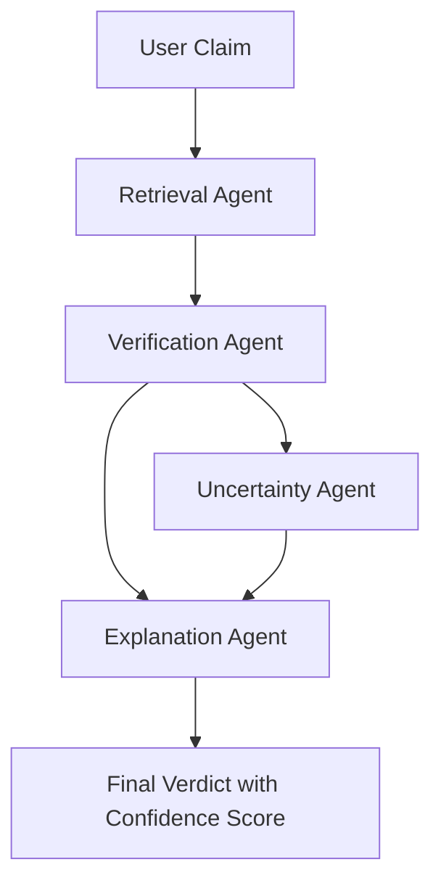

# 🔬 Multi-Agent RAG System for Scientific Paper Verification


This project implements a **Multi-Agent Retrieval-Augmented Generation (RAG)** system for verifying scientific claims using semantic similarity and explainable AI techniques.

The system retrieves relevant research papers, computes similarity scores, estimates uncertainty, and classifies claims as **Supported**, **Partially Supported**, or **Not Supported**. A highly polished and interactive dashboard is provided for users to seamlessly verify their claims.

---

## ✨ Project Overview

This system verifies scientific claims using:
- **Vector-based document retrieval** (FAISS)
- **Sentence Transformer embeddings** (`all-MiniLM-L6-v2`)
- **Cosine similarity scoring**
- **Confidence aggregation**
- **Uncertainty estimation**
- **Explainable output generation**
- **Streamlit-based interactive web interface**

---

## 🏛️ System Architecture



---

## 🤖 Multi-Agent Components

1. **RetrievalAgent**  
   Retrieves top-K similar scientific papers using an optimized FAISS vector search.
2. **VerificationAgent**  
   Computes semantic similarity and calculates the final confidence score based on the retrieved documents.
3. **UncertaintyAgent**  
   Measures evidence consistency using the variance of similarity scores.
4. **ExplanationAgent**  
   Generates a structured, metric-driven, and explainable output for algorithmic transparency.

---

## 🧮 Scoring Mechanism

**Final Score** = `(Average Similarity × 0.7) + (Evidence Density × 0.3)`

**Verdict Classification:**
- **Score > 0.65** → Supported ✅
- **0.4 < Score ≤ 0.65** → Partially Supported 〽️
- **Score ≤ 0.4** → Not Supported ❌

Uncertainty is calculated dynamically using similarity variance.

---

## 🛠️ Technologies Used

- **Python**
- **Sentence-Transformers** (`all-MiniLM-L6-v2`)
- **FAISS** (High-Performance Vector Database)
- **Scikit-Learn**
- **Pandas** & **NumPy**
- **Streamlit** (Frontend UI)

---

## 📂 Project Structure

```text
mini_project/
│
├── agents/
│   ├── retrieval_agent.py
│   ├── verification_agent.py
│   ├── explanation_agent.py
│   └── uncertainty_agent.py
│
├── data.csv                # Dataset containing scientific papers
├── vector_store.py         # FAISS Indexing and Embedding Logic
├── app.py                  # Streamlit Web Application
├── main.py                 # CLI Execution Application
├── requirements.txt        # Python Dependencies
└── README.md               # Project Documentation
```

---

## 🚀 Installation & Usage

1. **Clone the repository and install dependencies:**
   ```bash
   pip install -r requirements.txt
   ```

2. **Run the interactive application:**
   ```bash
   streamlit run app.py
   ```

3. **Open the browser:**  
   Navigate to `http://localhost:8501` to view your application.

---

## 🎓 Academic Concepts Demonstrated

- **Information Retrieval**
- **Natural Language Processing (NLP)**
- **Semantic Similarity Calculation**
- **Vector Databases (FAISS)**
- **Multi-Agent Architecture**
- **Explainable AI (XAI)**
- **Retrieval-Augmented Generation (RAG)**

---

**Author:**  
**Darpan Yaduvanshi**  
*MCA (Artificial Intelligence & Machine Learning)*
